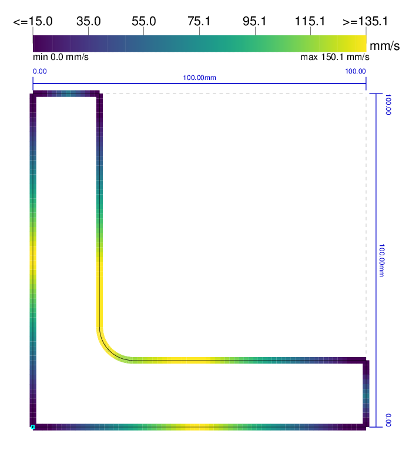
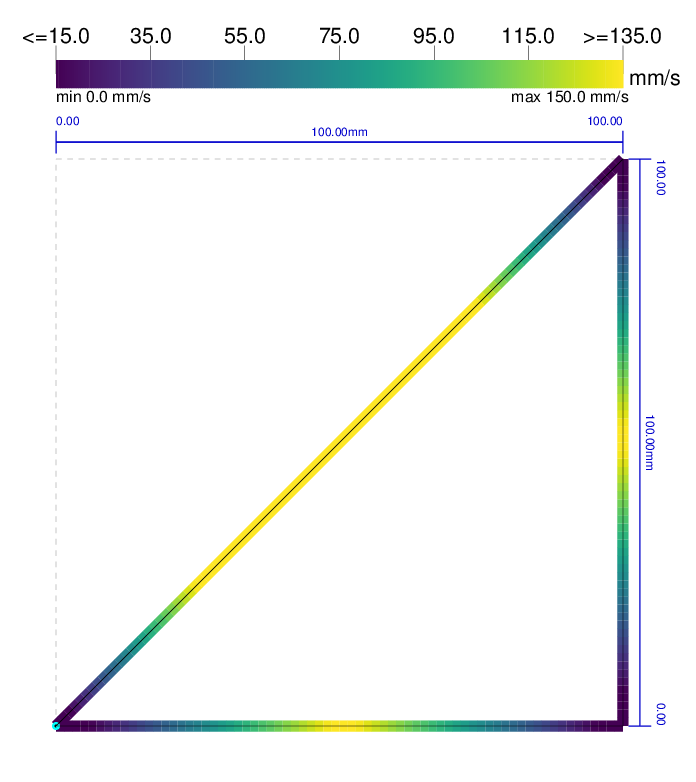
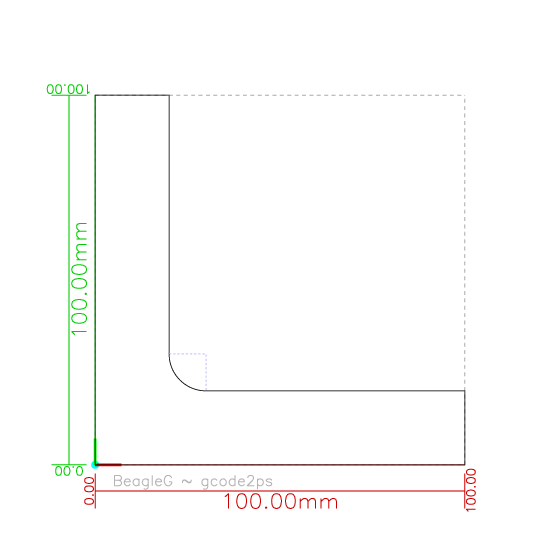
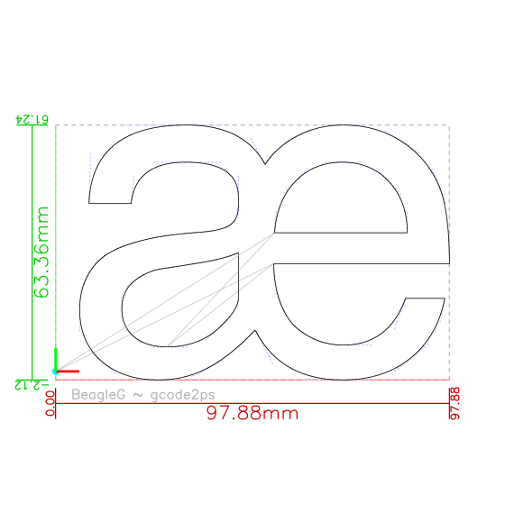
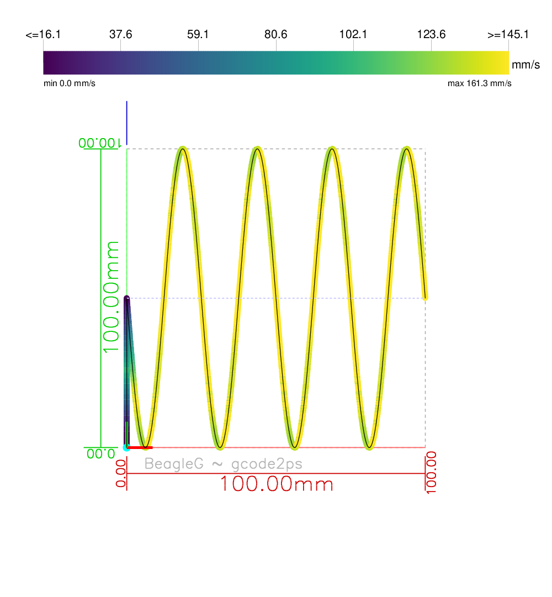
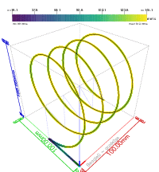
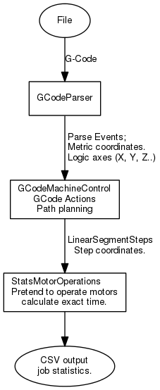

Development
-----------

If you want to get involved in the development and contribute, this page
is for you.

### Mailing List
Please subscribe to the
[mailing list](https://groups.google.com/forum/#!forum/beagleg-dev)

### Compilation
Due to the speed of the compiler on the BeagleBone, you might want to do
development on other machines for faster turn-around times (unless you really
need to actually access the hardware GPIOs or run PRU code, this works just
fine. With `-n`, you can just simulate).

On a non-Beaglebone machine, pass an empty `ARM_COMPILE_FLAGS` environment
variable:

```bash
 ARM_COMPILE_FLAGS="" make
 # or export to environment.
```

To speed up development (on all machines, but in particular if you compile on
the BeagleBone), it is definitely useful to have [ccache] installed
(package-installing is not enough, read the manpage to make sure to
properly enable it). It makes `make clean ; make` cycles _much_ faster.

### Tests
When doing development and adding new features, is advisable to run the tests
(and write your own). To avoid re-inventing the testing-framework wheel,
we use the [Google test framework](https://github.com/google/googletest),
for which there are typically already packages available:

```bash
 sudo apt-get install libgtest-dev google-mock
 make test
 # Or, for more thorough memory-leak or initialization issue check:
 make valgrind-test
 ```

### Coverage
To see if there is code that has not been covered in tests yet, there is
a target `make coverage`, that creates a `src/coverage.html` report with
links to individual files that show which lines have been visited.

You also need to have gcovr installed. Run this in the `src/` directory.

```
 sudo apt-get install gcovr
 make coverage
```

Note as always with coverage: if everything is green, it doesn't mean that the
code is sufficiently covered as it only reports if a line has been executed,
not if you have tested all the paths that you can reach a particular line.
But if a line is red it definitely means that none of the unit tests even
touched that piece of code.

### gcode2ps
Manual inspection is also useful. A little tool to visually inspect the planner
output is `src/gcode2ps`. It is a tool that reads gcode and outputs the raw
gcode path and the actual machine path with speed annotations. Generates
a printable PostScript file.

```
$ src/gcode2ps
Utility to visualize the GCode path and the resulting machine
movement with speed colorization, dependent on configuration.
(Without config, only GCode path is shown)

Usage: ./gcode2ps [options] <gcode-file>
Options:
        -o <output-file>  : Name of output file; stdout default.
        -c <config>       : BeagleG machine config.
        -T <tool-diameter>: Tool diameter in mm.
        -t <threshold-angle> : Threshold angle for accleration opt.
        -s                : Visualize movement speeds.
        -D                : Don't show dimensions.
        -M                : Don't show machine path, only GCode path.
        -i                : Toggle show IJK control lines.
[---- Visualization ---- ]
        -w<width>         : Width in point (no unit) or mm (if appended)
        -e<distance>      : Eye distance in mm to show perspective.
        -a<frames>        : animation: create these number of frames showing rotation around vertical.
[---- Rotation. Multiple can be applied in sequence ----]
        -R<roll>          : Roll: Rotate around axis pointing towards and through canvas
        -P<roll>          : Pitch: Rotate around horizontal axis.
        -Y<roll>          : Yaw: Rotate around vertical axis.
        -V<view>          : Shortcut: view. One of {front, isometric, left, right, top}
```

With the `-s` option, it is possible to visualize the speed, so you can see
where the tool-path is accelerated and decelerated (this is directly taken
out of the planner output, so it is _exactly_ what BeagleG would do with
a real amchine. This is why it is invaluable as debugging tool).

For easier handling (or sending examples to the mailing list), you might want
to convert the result into a PNG image. The tool prints out how you'd call
ghostscript to do the conversion:

```bash
$ src/gcode2ps -w800 -o /tmp/hello.ps -c machine.config -s somegcode.gcode
-- Convert to image /tmp/hello.ps.png with --
gs -q -dBATCH -dNOPAUSE -sDEVICE=png16m -dGraphicsAlphaBits=4 -dTextAlphaBits=4 -dEPSCrop -sOutputFile=/tmp/hello.ps.png /tmp/hello.ps
```



If you don't give a machine-configuration (`-c`) or give the `-M` option, only
the gcode path is displayed (note that helper lines such as the radius
indication of the `G3` call or the spline control-point vectors in the
second example are shown in dotted lightblue; you can switch
that off with `-i`). Rapid moves (`G0`) are light-gray, regular moves (`G1`)
black:



By default, the output shows a top view of the X/Y axis, but you can
choose a view with `-V` or choose rotation. In this example, the same 3D path
shown with `-Vtop` (which is also the default) vs. `-Visometric`
(you can abbreviate these views, e.g. `-Vt` and `-Vi` would work as well).



The default view is orthogonal, but with `-e<eye-distance>`, you can add
perspective. Note: the 3D projection is calculated in the PostScript itself,
so you can edit the file and modify the projection angles there.

As a, wait for it, _silly twist_, you can also generate animations; enable
with the `-a` option. Here `-e150 -a36`, generating 36 frames.



This tool is used for the visual end2end output creating a HTML page with
images of a set of testing `*.gcode` files:

```
make -C src test-html
```

### Overview: processing pipeline
The processing is event driven: The incoming GCode gets fed through the
`GCodeParser` which then pipes the events to the `GCodeMachineControl`.
Movement commands are pipelined and queued as they need to be buffered
to do path and accleration planning. This also prevents machine stalls while
waiting on GCode input.

This is a overview of the pipeline components:


### APIs
The functionality is implemented in a stack of independently usable APIs.
Each part of the stack has some well-defined task, and possibly delegates
action levels down.

   - [gcode-parser.h](./src/gcode-parser/gcode-parser.h) : C++-API for parsing
      [G-Code](./G-code.md) that calls callback parse events, while taking
      care of many internals, e.g. interpreting slightly different dialects and
      automatically translates everything into metric, absolute coordinates for
      ease of downstream receivers.
      This API in itself is independent of the rest, so it might be useful
      in other contexts as well.

   - [gcode-machine-control.h](./src/gcode-machine-control.h) : highlevel
      C++-API to control a machine via G-Code: it receives G-Code events
      and provides the services actually needed to control a machine - from
      dealing with homing, showing the current position or issue machine
      moves. The machine moves are delegated to the planner for further
      processing.
      Depends on the gcode-parser APIs as input and motor-operations as output.
      Provides the functionality provided by the `machine-control` binary.
      If you want, you can use this API to programmatically control your machine
      without the detour through GCode.

   - [planner.h](./src/planner.h) : From a sequence of requested target
      positions with a desired speed of segments, plans actually pysically
      possible moves with speed/accleration segment joining, maps the
      axis moves to step count for motors and emits the resuling number
      of steps with start- and end-speed to MotorOperations.

   - [motor-operations.h](./src/motor-operations.h) : Low-level motor motion
      C++-API.
      Receives travel speeds and speed transitions from the planner.
      This is a good place to implement stepmotor driver backends.
      There are various implementations here for visualization, and one
      (`MotionQueueMotorOperations`) that is preparing the output for the
      next lower hardware level: the `MotionQueue`. For that, it prepares
      parameters for the discrete approximation in the PRU motion-queue backend.

   - [motion-queue.h](./src/motion-queue.h) : Even lower level interface: queue
      between motor-operations and hardware creating motion profiles in realtime.
      The implementation is done in the BeagleBone-PRU, but is separated out
      enough that it is not dependent on it: The required operations could be
      implemented in microcontrollers or FPGAs (32 bit operations help...).
      There is a simulation implementation (`sim-firmware.cc`) that illustrates
      what to do with the parameters. The simulation just outputs the would-be
      result as CSV file (good for debugging and visualization with gnuplot).

   - [determine-print-stats.h](./src/determine-print-stats.h): Highlevel API
      facade to determine some basic stats about a G-Code file; it processes
      the entire file and determines estimated print time, filament used etc.
      Since this takes the actual travel planning into account, the values are
      a correct prediction of the actual print or CNC time. Implements
      a `GCodeParser::EventReceiver` and a `MotorOperations` interface to get
      all the necessary information to calculate the needed time.

   - gcode2ps is a utility that outputs gcode and resulting motor-movements
     as PostScript image to help visualize in development.

The interfaces are C++ objects.

### API show case: GCode stats printing

Due to the separation of the various components, it is possible to create
exact predition of the machine times with the `gcode-print-stats` binary. The
stacking is a bit differently, as it replaces the MotorOperations with an
implementation that just adds up how long motors would move.

Since this goes through the same motion planning and takes current speed and
acceleration into account, it can predict the runtime of a job down to the
second.

It only takes a couple of seconds to simulate and pre-calculate the wall-time
of many-hour long jobs. This might be useful to display to the user.



[ccache]: https://ccache.samba.org/