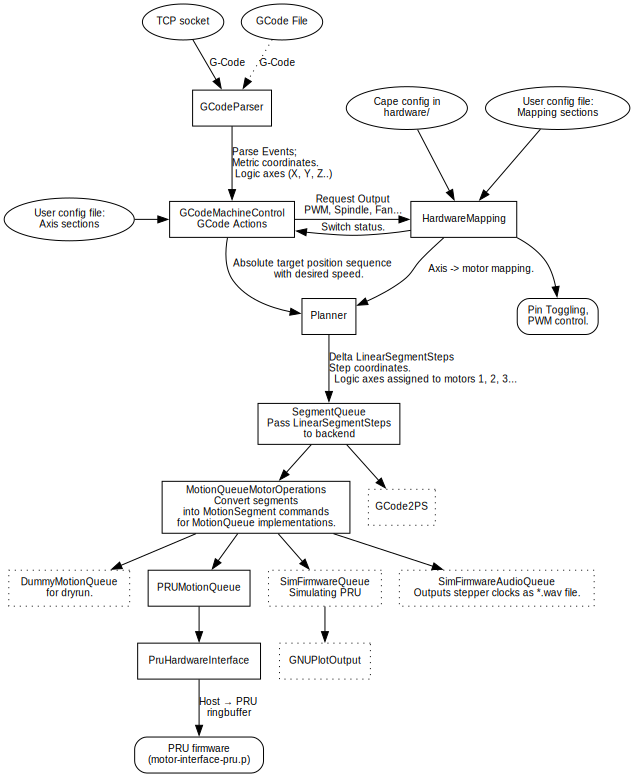

Development
-----------

If you want to get involved in the development and contribute, this page
is for you.

### Compilation
Due to the speed of the compiler on the BeagleBone, you might want to do
development on other machines for faster turn-around times (unless you really
need to actually access the hardware GPIOs or run PRU code, this works just
fine. With `-n`, you can just simulate).

On a non-Beaglebone machine, pass an empty `ARM_COMPILE_FLAGS` environment
variable:

```bash
 ARM_COMPILE_FLAGS="" make
 # or export to environment.
```

To speed up development (on all machines, but in particular if you compile on
the BeagleBone), it is definitely useful to have [ccache] installed
(package-installing is not enough, read the manpage to make sure to
properly enable it). It makes `make clean ; make` cycles _much_ faster.

### Tests
When doing development and adding new features, is advisable to run the tests
(and write your own). To avoid re-inventing the testing-framework wheel,
we use the [Google test framework](https://github.com/google/googletest),
for which there are typically already packages available:

```bash
 sudo apt-get install libgtest-dev google-mock
 make test
 # Or, for more thorough memory-leak or initialization issue check:
 make valgrind-test
 ```

### Overview: processing pipeline
The processing is event driven: The incoming GCode gets fed through the
`GCodeParser` which then pipes the events to the `GCodeMachineControl`.
Movement commands are pipelined and queued as they need to be buffered
to do path and accleration planning. This also prevents machine stalls while
waiting on GCode input.

This is a rough overview of the components:



### APIs
The functionality is implemented in a stack of independently usable APIs.

   - [gcode-parser.h](./src/gcode-parser.h) : C++-API for parsing
      [G-Code](./G-code.md) that calls callback parse events, while taking
      care of many internals, e.g. interpreting slightly different dialects and
      automatically translates everything into metric, absolute coordinates for
      ease of downstream receivers. This API in itself is independent of the
      rest, so it might be useful in other contexts as well.

   - [gcode-machine-control.h](./src/gcode-machine-control.h) : highlevel
      C++-API to control a machine via G-Code: it receives G-Code events, does
      motion planning, axis mapping, speed/accleration segment joining and emits
      the resuling motor commands to MotorOperations.
      Depends on the gcode-parser APIs as input and motor-operations as output.
      Provides the functionality provided by the `machine-control` binary.
      If you want, you can use this API to programmatically control your machine
      without the detour through GCode.

   - [motor-operations.h](./src/motor-operations.h) : Low-level motor motion
      C++-API.
      Receives travel speeds and speed transitions from gcode machine control
      planner. This is a good place to implement stepmotor driver backends.
      The implementation here prepares parameters for the discrete
      approximation in the PRU motion-queue backend.
      The `gcode-print-stats` binary has a different implementation that uses it to
      determine print-time calculations, simulating how long motor movements
      would take.

   - [motion-queue.h](./src/motion-queue.h) : Even lower level interface: queue
      between motor-operations and hardware creating motion profiles in realtime.
      The implementation is done in the BeagleBone-PRU, but is separated out
      enough that it is not dependent on it: The required operations could be
      implemented in microcontrollers or FPGAs (32 bit operations help...).
      There is a simulation implementation (sim-firmware.cc) that illustrates
      what to do with the parameters. The simulation just outputs the would-be
      result as CSV file (good for debugging).

   - [determine-print-stats.h](./src/determine-print-stats.h): Highlevel API
      facade to determine some basic stats about a G-Code file; it processes
      the entire file and determines estimated print time, filament used etc.
      Since this takes the actual travel planning into account, the values are
      a correct prediction of the actual print or CNC time.

The interfaces are C++ objects.

### API show case: GCode stats printing

Due to the separation of the various components, it is possible to create
exact predition of the machine times with the `gcode-print-stats` binary. The
stacking is a bit differently, as it replaces the MotorOperations with an
implementation that just adds up how long motors would move.

Since this goes through the same motion planning and takes current speed and
acceleration into account, it can predict the runtime of a job down to the
second.

It only takes a couple of seconds to simulate and pre-calculate the wall-time
of many-hour long jobs. This might be useful to display to the user.


