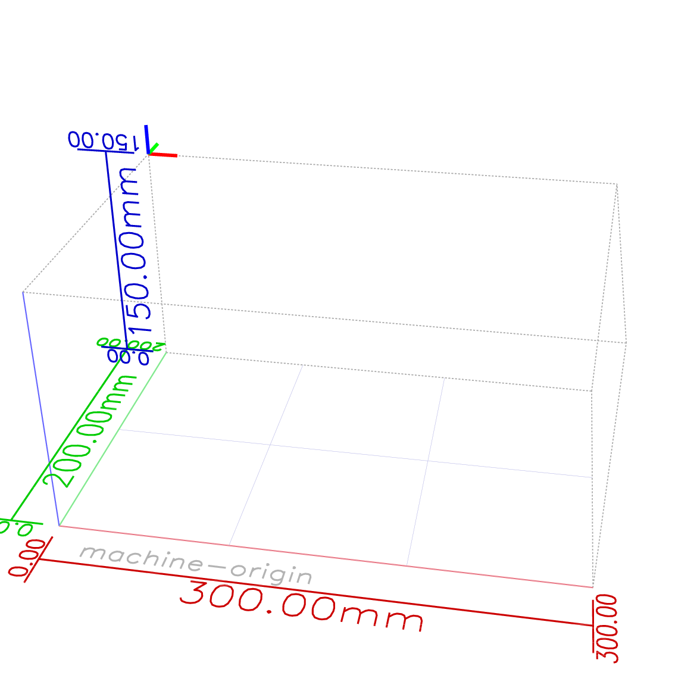
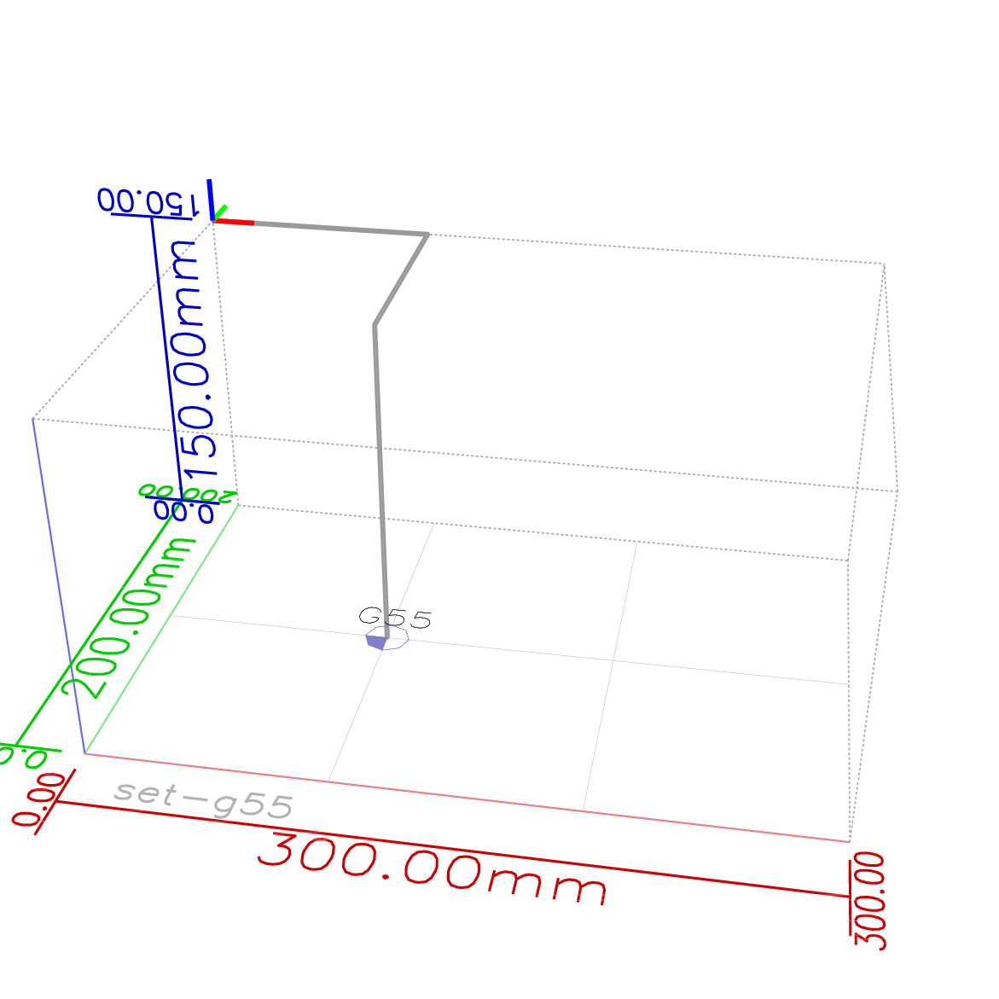
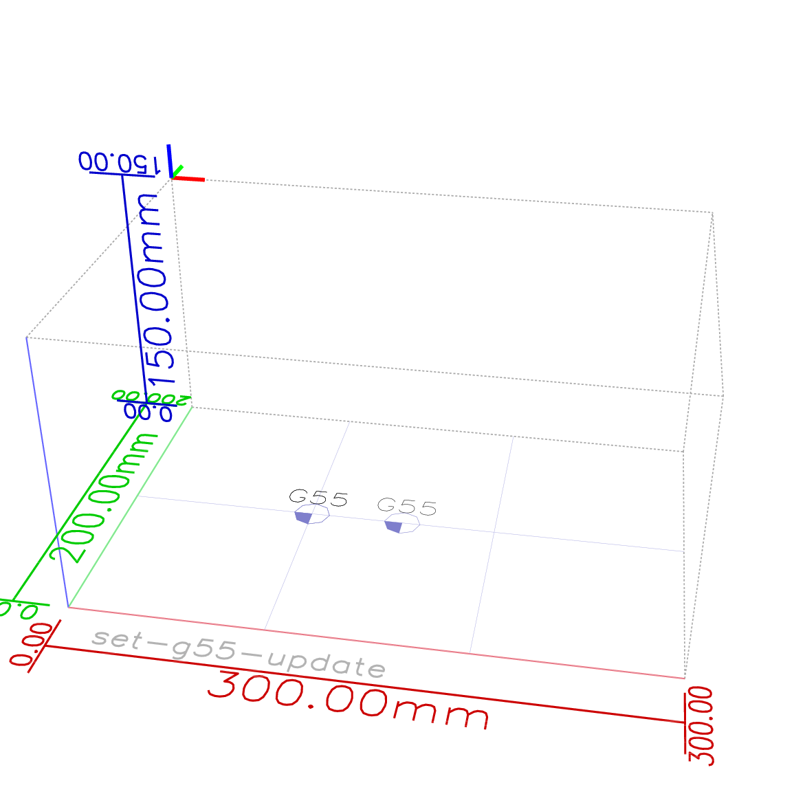

BealgeG G-Code interpretation
-----------------------------

##Syntax

G-Code is essentially a pair of 'letters' and 'numbers' that tell the machine
what to do. It is well described [somewhere else][Intro GCode], so this is only a
quick overview.
G-Codes are typically organized in lines. These are typical commands:

    G1 X10 Y20 ; move to X-coordinate 10 and Y=20
    G1X0Y8     ; no need for spaces between pairs - but readability sucks.
    G1 X10 (small move) Y200 (big move) ; comments can be in-line with parenthesis
    G1 X10 Y100 G1 X0 Y0  ; multiple commands can be in one line.

`G1` means: move in a coordinated move, i.e. the axis move in a way that the
final move resembles a straight line in the N-dimensional space they are in.
Comments can be at the end of line and start with a semicolon.

There can be comments _between_ pairs with parenthesis. This is not supported
by every G-Code interpreter, but BeagleG does:

    G1(coordinated move) X10(to this position)

## Parameters / Expressions and Binary/Unary Operations

BeagleG supportes the use of parameters. A parameter is specified by a pound
character `#` followed by an integer value. Currently parameters 0 to 5399 are
supported. Parameter 0 is read-only and always evaluates to `0.0f`. Some of the
parameters are used internally, these are all in the > 5000 range and should
not be used.

Parameter setting is done by:
* a pound character `#`
* an integer value between `1` and `5399`
* an equal sign `=`
* a real value

For example `#1=123.4` is a parameter setting meaning set parameter 1 to 123.4.

Unlike the [NIST RS274NGC] specification, parameter setting takes effect immediately.
For example, `G1 #1=10 X#1` will result in a coordinated move to X=10.

Parameters are not currently persistent. All parameters default to `0.0f`.

Expressions are also supported along with Binary/Unary operations. An expression
is a set of character starting with a left bracket `[` and ending with a balanced
right bracket `]`. In between the brackets are numbers, parameter values,
mathematical operations, and other expressions. Expressions are evaluated to
produce a number. An example of an expression is `[1 + cos[0] - [#3 ** [4.0/2]]]`.

Binary operations appear only inside excpressions. Nine binary operations are
defined. These are four basic mathematical operations: addition `+`, subtraction `-`,
multiplication `*`, and division `/`. There are three logical operations:
non-exclusive or `OR`, exculsive or `XOR`, and logical and `AND`. The eighth
operation is the modulus operation `MOD`. The ninth operation is the "power"
operation `**` of raising the number on the left of the operation to the power
on the right.

A unary operation is either `ATAN` followed by one expression divided by another
expression (for example `ATAN[2]/[1+3]`) or any other unary operation followed
by an expression (for example `SIN[90]`). The unary operations are: absolute value
`ABS`, arc cosine `ACOS`, arc sine `ASIN`, arc tangent `ATAN`, cosine `COS`,
e raised to the given power `EXP`, round down `FIX`, round up `FUP`, natural
logarithm `LN`, round down to the nearest whole number `ROUND`, sine `SIN`,
square root `SQRT`, and tangent `TAN`. Arguments to unary operations which
take angle measurements (`COS`, `SIN`, and `TAN`) are in degrees. Values returned
by unary operations which return angle measurements (`ACOS`, `ASIN`, and `ATAN`)
are also in degrees.

## Supported commands

Supported commands are currently added on a need-to-have basis. They are a subset
of G-Codes found documented in [LinuxCNC] and [RepRap Wiki].

The following commands are supported. A place-holder of `[coordinates]` means
a combination of axis coordinates (such as `X10 Y20`) and an optional feedrate
(`F1000`).
Current set of supported axis-letters is X, Y, Z, E, A, B, C, U, V, W (the
`--axis-mapping` flag decides which make it to motors).

Line numbers `Nxx` and checksums `*xx` are parsed, but discarded and ignored
for now.

### G Codes

Command          | Callback             | Description
---------------- |----------------------|------------------------------------
G0 [coordinates] | `rapid_move()`       | Move to coordinates
G1 [coordinates] | `coordinated_move()` | Like G0, but guarantee linear move
G2 [end] [offset]| `coordinated_move()` | Clockwise arc
G3 [end] [offset]| `coordinated_move()` | Counterclockwise arc
G4 Pnnn          | `dwell()`            | Dwell (wait) for nnn milliseconds.
G5 [see below]   | `coordinated_move()` | Cubic spline in XY plane
G5.1 [see below] | `coordinated_move()` | Quadratic spline in XY plane
G10 L2 Px [coord]| -                    | Set coordinate system data
G17              | -                    | XY plane selection.
G18              | -                    | ZX plane selection.
G19              | -                    | YZ plane selection.
G20              | -                    | Set coordinates to inches.
G21              | -                    | Set coordinates to millimeter.
G28 [coordinates]| `handle_home()`      | Home the machine on given axes.
G30 [Z<thick>]   | `handle_z_probe()`   | Z Probe, with optional target thickness.
G54              | -                    | Select coordinate system 1 (G10 L2 P1 ...)
G55              | -                    | Select coordinate system 2 (G10 L2 P2 ...)
G56              | -                    | Select coordinate system 3 (G10 L2 P3 ...)
G57              | -                    | Select coordinate system 4 (G10 L2 P4 ...)
G58              | -                    | Select coordinate system 5 (G10 L2 P5 ...)
G59              | -                    | Select coordinate system 6 (G10 L2 P6 ...)
G59.1            | -                    | Select coordinate system 7 (G10 L2 P7 ...)
G59.2            | -                    | Select coordinate system 8 (G10 L2 P8 ...)
G59.3            | -                    | Select coordinate system 9 (G10 L2 P9 ...)
G70              | -                    | Set coordinates to inches.
G71              | -                    | Set coordinates to millimeter.
G90              | -                    | Coordinates are absolute.
G91              | -                    | Coordinates are relative.
G92 [coordinates]| -                    | Set position to be the new zero.
G92.1            | -                    | Reset G92 offset
G92.2            | -                    | Suspend G92 offset
G92.3            | -                    | Restore G92 offset

#### G5 syntax

G5 creates a cubic B-spline in the XY plane with the X and Y axes only. P and Q
must both be specified for every G5 command.

For the first G5 command in a series of G5 commands, I and J must both be specified.
For subsequent G5 commands, either bot I and J must be specified, or neither. If
I and J are unspecified, the first control point will be the negation of the
previous second control point.

`G5 X- Y- <I- J-> P- Q-`

* `X- Y-` - end point of spline (absolute or relative depending on current mode)
* `I- J-` - relative offset from start point to first control point
* `P- Q-` - relative offset from end point to second control point

#### G5.1 syntax

G5.1 creates a quadratic B-spline in the XY plane with the X and Y axes only.
Not specifying I or J gives zero offset for the unspecified axis, so one or
both must be given.

`G5.1 X- Y- I- J-`

* `X- Y-` - end point of spline (absolute or relative depending on current mode)
* `I- J-` - relative offset from start point to control point

### Coordinate Systems

#### Machine Origin
The Machine Origin is defined to be where the end-switches are located, i.e.
where the `home-pos` is configured for that particular axis in the
configuration file (see [sample.config](sample.config)). Together with the
range with each axis, this defines the available machine cube within the
tool can move.

The `machine-control` program will always make sure that the machine is never
allowed to execute moves that escape this machine cube.

Often, the home position is not at the bottom left corner of the machine cube
as one would expect in a simple coordinate system with only positive
coordinates. In particular CNC machines for instance have the Z-axis origin
at the very top (as homing at the very bottom will certainly crash the spindle
somewhere). So relative to the _machine origin_, only negative Z coordinates
are valid in that case.

Let's assume a machine that has the X axis homed on the left, but the Y axis
on the back of the machine cube and the Z axis on the top; in the
[gcode2ps]-visualization, this shows a little right-handed coordinate system
marker, colored in Red (X-Axis), Green (Y) and Blue (Z) at the left/back/top of
the machine cube:



#### Work Coordinate Systems

BeagleG supports 9 work coordinate system slots, G54-G59 and G59.1-G59.3.

The position of these coordinate system can be set using the `G10` command
according to the G-Code standard with `P1` to `P9` referencing the work
coordinate systems `G54`, `G55`, etc. When setting the
coordinate system, the X/Y/Z values passed to G10 always are relative to
the _machine origin_. Let's set the G55 coordinate
system (`P2`). We want it to be at the bottom of the machine cube, 100mm in X/Y
direction from the left bottom corner. Given the homing position of our
sample machine, this is partially in negative coordinates:

```
G10 L2 P2 X100 Y-100 Z-150 (100mm to the right, 100mm to the front and 150mm down)
```



The coordinate was given in this case in the context of common absolute
coordinates (`G90`).
If coordinates are chosen to be relative with `G91`, we are _updating_ the
coordinates _relative_ to the previous location of the work coordinate system.
So with a

```
G91 G10 L2 P2 X50 (50mm to the right)
```

We are moving G55 work coordinate system 50mm to the right relative to its
previous location:



#### Default work coordinate system

If you have specified a parameter file (with the `--param` option to
`machine-control`), the last used coordinate system including its configured
position is chosen.
Otherwise `G54` is the default coordinate system originating at the machine
origin.

So in particular if you are having a machine origin at an inconvenient spot,
it is a good idea to supply a parameter file to persistently configure your
coordinate systems.

### M Codes

Command          | Callback              | Description
-----------------|-----------------------|-----------------------------
M2               | `gcode_finished()`    | Program end. Resets back to defaults.
M24              | `wait_for_start()`    | Start/resume a program. Waits for the start input if available.
M17              | `motors_enable()`     | Switch on motors.
M18              | `motors_enable()`     | Switch off motors.
M30              | `gcode_finished()`    | Program end. Resets back to defaults.
M84              | `motors_enable()`     | Switch off motors.
M82              | -                     | Set E-axis to absolute.
M83              | -                     | Set E-axis to relative.
M104 Snnn        | `set_temperature()`   | Set temperature in celsius.
M116             | `wait_temperature()`  | Wait for temperature to be reached
M109 Snnn        | `set_t.., wait_t..()` | Combination of M104, M116: Set temperature and wait for it to be reached.
M106 Snnn        | `set_fanspeed()`      | set speed of fan; 0..255
M107             | `set_fanspeed(0)`     | switch off fan.
M111 Snnn        | -                     | Set debug level.
M220 Snnn        | `set_speed_factor()`  | Set output speed factor.
M500             | `save_params()`       | Save parameters.
M501             | `load_params()`       | Load parameters.

### M Codes dealt with by gcode-machine-control
The standard M-Code are directly handled by the G-code parser and result
in parametrized callbacks. Other not quite standard G-codes are handled in
[gcode-machine-control](./gcode-machine-control.c) when receiving
the `unprocessed()` callback (see API below):

Command          | Description
-----------------|----------------------------------------
M0               | Unconditional stop, sets Software E-Stop.
M3 Sxx           | Spindle On Clockwise at speed Sxx
M4 Sxx           | Spindle On Counterclockwise at speed Sxx
M5               | Spindle Off
M7               | Turn mist on
M8               | Turn flood on
M9               | Turn all coolant off
M10              | Turn on vacuum
M11              | Turn off vacuum
M42 Pnn          | Get state of AUX Pin nn.
M42 Pnn Sxx      | Set AUX Pin nn to value xx
M62 Pnn          | Set AUX Pin nn to 1
M63 Pnn          | Set AUX Pin nn to 0
M64 Pnn          | Set AUX Pin nn to 1; updates immediately, independent of buffered moves.
M65 Pnn          | Set AUX Pin nn to 0; updates immediately, independent of buffered moves.
M80              | ATX Power On.
M81              | ATX Power Off.
M105             | Get current extruder temperature.
M114             | Get current position; coordinate units in mm.
M115             | Get firmware version.
M117             | Display message.
M119             | Get endstop status.
M120             | Enable pause switch detection.
M121             | Disable pause switch detection.
M245             | Start cooler
M246             | Stop cooler
M355             | Turn case lights on/off
M400             | Wait for queue to be empty. Equivalent to G4 P0.
M999             | Clear Software E-Stop.

### Feedrate in Euclidian space
The axes X, Y, and Z are dealt with specially by `gcode-machine-control`: they are
understood as representing coordinates in an Euclidian space (not entirely
unwarranted :) ) and thus applies a feedrate in a way that the resulting
path sees the given speed in space, not each individual axis:

    G28 G1 X100      F100  ; moves X with feedrate 100mm/min
    G28 G1 X100 Y100 F100  ; moves X and Y with feedrate 100/sqrt(2) ~ 70.7mm/min

## API
G-code parsing as provided by [the G-Code parse API](./gcode-parser/gcode-parser.h) receives
G-code from a file-descriptor (via the `int gcodep_parse_stream()` function)
and calls parametrized parse-callbacks representing slightly more higher-level commands.

The coordinates passed to callbacks are _always_ pre-converted to machine-absolute and
metric to make implementation of the callback receivers easy.
The codes `G20`/`G21`/`G70`/`G71` and `G90`/`G91`/`G92` as well as
`M82`, `M83` are handled internally to always output absolute, metric coordinates.

Currently, the GCode parser also implements `G2` and `G3` and emits line-segments with
`coordinated_move()` callbacks (this should probably move outside the parser).

Commands that are not recognized are passed on to the `unprocessed()` callback
for the user to handle (see description in API).

[LinuxCNC]: http://linuxcnc.org/docs/html/gcode.html
[RepRap Wiki]: http://reprap.org/wiki/G-code
[Intro GCode]: http://en.wikipedia.org/wiki/G-code
[NIST RS274NGC]: http://spin1-www.nist.gov/customcf/get_pdf.cfm?pub_id=823374
[gcode2ps]: ./Development.md#gcode2ps