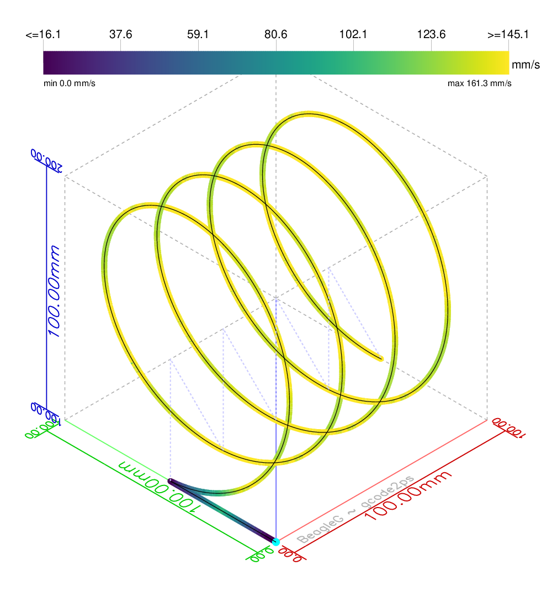

BeagleG
=======

Step-motor controller for CNC-like devices (or 3D printers) using the
PRU (Programmable Realtime Unit) of the Beaglebone Black to create precisely
timed and fast stepper-pulses for acceleration and travel.
(And with fast, we're talking up to 1Mhz fast. For 8 motors in parallel.
In a controlled move (G1). So this is not a limit in real-world applications).

Works with a cape designed by the author (the [BUMPS] cape), but also provides
relatively easy adaption to new hardware (currently: support for CRAMPS). See
[hardware](./hardware) subdirectory.

This was one of my very early tests:
[![First Test][run-vid]](http://youtu.be/hIEY9077D64)

The {accl-,decel-}eration and travel motion profile is entirely
created within the PRU from parameters sent by the host CPU decoupled via a
ring-buffer.
The BeagleBone main CPU prepares the data, such as parsing the
[G-Code](./G-code.md) and doing travel planning, while all the real-time
critical parts are done in the PRU. The host CPU typically needs less
than 1% CPU-time doing everything else (and there is no need for a real-time
kernel).

The main `machine-control` program is parsing G-Code, extracting axes moves and
enqueues them to the realtime unit. It can receive G-Code from a file or
socket (you can just telnet to it for an interactive session, how
cool is that?).

## Install
For system configuration and building the `machine-control` binary, see
[INSTALL.md](./INSTALL.md).

## Getting started
Before you can use beagleg and get meaningful outputs on the GPIO pins,
we have to tell the pin multiplexer to connect them to the output pins. For
that, just run the `start-devicetree-overlay.sh` script with your hardware
to install the device overlay. You find it in the `hardware/` subdirectory.

    sudo hardware/start-devicetree-overlay.sh hardware/BUMPS/BeagleG.dts

See the [Hardware page](./hardware) how to enable the cape at boot time.
(Note: this section will be simpler once we switched entirely to universal
cape).

## Machine control binary
To control a machine with G-Code, use the `machine-control` binary.
This either takes a filename or a TCP port to listen on.

```
Usage: ./machine-control [options] [<gcode-filename>]
Options:
  -c, --config <config-file> : Configuration file. (Required)
  -p, --port <port>          : Listen on this TCP port for GCode.
  -b, --bind-addr <bind-ip>  : Bind to this IP (Default: 0.0.0.0).
  -l, --logfile <logfile>    : Logfile to use. If empty, messages go to syslog (Default: /dev/stderr).
      --param <paramfile>    : Parameter file to use.
  -d, --daemon               : Run as daemon.
      --priv <uid>[:<gid>]   : After opening GPIO: drop privileges to this (default: daemon:daemon)
      --help                 : Display this help text and exit.

Mostly for testing and debugging:
  -f <factor>                : Feedrate speed factor (Default 1.0).
  -n                         : Dryrun; don't send to motors, no GPIO or PRU needed (Default: off).
  -P                         : Verbose: Show some more debug output (Default: off).
  -S                         : Synchronous: don't queue (Default: off).
      --allow-m111           : Allow changing the debug level with M111 (Default: off).

Segment acceleration tuning:
     --threshold-angle       : Specifies the threshold angle used for segment acceleration (Default: 10 degrees).
     --speed-tune-angle      : Specifies the angle used for proportional speed-tuning. (Default: 60 degrees)

                               The --threshold-angle + --speed-tune-angle must be less than 90 degrees.

Configuration file overrides:
     --homing-required       : Require homing before any moves (require-homing = yes).
     --nohoming-required     : (Opposite of above^): Don't require homing before any moves (require-homing = no).
     --norange-check         : Disable machine limit checks. (range-check = no).
```

The axis configurations (max feedrate, acceleration, travel, motor mapping,...)
is configured in a [configuration file like in this example](./sample.config).

The G-Code understands logical axes X, Y, Z, E, A, B, C, U, V, and W.

More details about the G-Code code parsed and handled can be found in the
[G-Code documentation](./G-code.md).

### Examples

For testing your motor settings, you might initially just have a simple
file:

    sudo ./machine-control -c my.config -f 10 myfile.gcode

Output the file `myfile.gcode` in 10x the original speed (say you want to
stress-test). Note, the factor will only scale feedrate, but the machine will
always obey the machine constraints with maximum feed and acceleration given in
the configuration file.

    echo "G1 X100 F10000 G1 X0 F1000" | sudo ./machine-control /dev/stdin

This command directly executes some GCode coming from stdin. This is in
particular useful when you're calibrating your machine and need to work on
little tweaks.

    sudo ./machine-control -c my.config --port 4444

Listen on TCP port 4444 for incoming connections and execute G-Codes over this
line. So you could use `telnet beaglebone-hostname 4444` to have an interactive
session or send a file simple via `socat` from a remote machine:

     cat myfile.gcode | socat -t5 - TCP4:beaglebone-hostname:4444

Use `socat`, don't use the ancient `nc` (netcat) - its buffering seems to be
broken so that it can get stuck. With `socat`, it should be possible to connect
to a pseudo-terminal in case your printer-software only talks to a terminal
(haven't tried that yet, please let me know if it works).

Note, there can only be one open TCP connection at any given time (after all,
there is only one physical machine).

## G-Code stats binary
There is a binary `gcode-print-stats` to extract information from the G-Code
file e.g. accurate expected print-time, Object height (=maximum Z-axis),
filament length. This is in particular useful because many GCode runtime
estimators are widely off; this is accurate to the second because it takes all
acceleration phases into account.

```
Usage: ./gcode-print-stats [options] <gcode-file> [<gcode-file> ..]
Options:
        -c <config>       : Machine config
        -f <factor>       : Speedup-factor for feedrate.
        -H                : Toggle print header line
Use filename '-' for stdin.
```

The output is in column form, so you can use standard tools to process them.
For instance, from a bunch of gcode files, find the one that takes the longest
time

    ./gcode-print-stats -c my.config *.gcode | sort -k2 -n

## Cape

The [BUMPS]-cape is one of the capes to use, it was developed together with
BeagleG (but it is not widely distributed yet).
BeagleG also works with the CRAMPS board, which is a popular motor driver cape
for the BeagleBone Black. You can easily adapt your own hardware, check the
[hardware](./hardware) sub-directory.

![Bumps board][BUMPS-img]

### Axis to Motor mapping

Each board has a number of connectors for motors and switches to which you
connect your physical motors and end-switches to.

To map these connector positions to logical axes names, the `machine-control`
binary has a configuration file in which you can configure not only the
various axis parameters (max speed, acceleration, steps/mm), but also assign
these axes to motor drivers provided by the cape (`motor_1`, `motor_2`,...)
and end switches (`switch_1`, `switch_2`,...) to logical functions
(e.g. `min_x`). See the [annotated config file](./sample.config).

## Development

If you want to use the nicely seprated sub-APIs of BeagleG programmatically
or want to get involved in the development, check
the [Development](./Development.md) page.

<a href="Development.md"></a>

## License
BeagleG is free software: you can redistribute it and/or modify
it under the terms of the GNU General Public License as published by
the Free Software Foundation, either version 3 of the License, or
(at your option) any later version.

## TODO
Not everything I'd like to have is implemented yet, but getting closer as weekend
hacking permits.

   - Needed for full 3D printer solution: add PWM/PID-loop for heaters.
   - Fast pause without waiting for queues to empty, but still be able to
     recover exact last position. That way pause/resume is possible.
   - ...

[run-vid]: ./img/beagleg-vid-thumb.jpg
[BUMPS]: https://github.com/hzeller/bumps
[BUMPS-img]: ./img/bumps-connect.jpg
[ccache]: https://ccache.samba.org/
