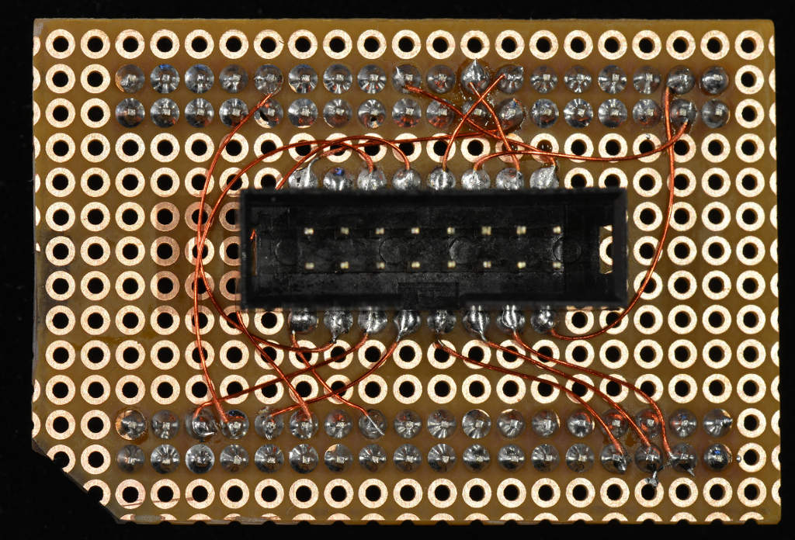

Pockegotion hardware definition
===============================

*(work in progress)*

This is for Pockegotion, the PocketCape to interface with an [Quadrigotion]
board. In addition to the Quadrigotion interface, it
will have a couple of opto-coupled inputs and PWM outputs.

Pins are defined with the universal overlay, so can be loaded with

```
config-pin -f pockegotion.pins
```

The 'cape' is pretty much experimental right now:

[][G+post]


[Quadrigotion]: http://quadrigotion.org/
[G+post]: https://plus.google.com/u/0/+HennerZeller/posts/DC3vYcE9zw8